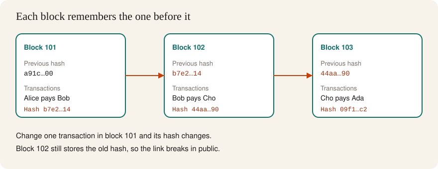

#  1. Foundations

> You can explain what a blockchain stores, why the blocks are linked, and which problems that design is meant to solve.

**Time.** 3–4 hours.
**You need.** A browser and a notes file.
**Words you will own.** Block, transaction, hash, node, consensus, ledger.

## The idea in one minute

A blockchain is a shared history of updates. Many computers keep a copy. New updates are grouped into a block. Each block includes a fingerprint of the block before it. Change an old update, and every fingerprint after it no longer matches. The network can see the edit.

People use that when they want a record that no single company can quietly rewrite. Payments were the first famous use. Programs that run on the shared record came next. That second idea is Ethereum, and it waits until [stage 4](04-ethereum.md).

## Picture

Read the arrows left to right. The hash printed on one block is the previous hash stored in the next block. The chain is a trail of fingerprints.

## A ledger before the software

Imagine a club notebook that records who paid for dinner.

- Every member keeps a photocopy of the notebook
- New pages are added only at the end
- A new page quotes the last page's fingerprint
- Members accept a page when enough of them agree it follows the rules

The notebook is the ledger. A page is a block. A line on the page is a transaction. A member's photocopy is a node: one computer running the network's software and storing the history.

Agreement on the next page is consensus. Different networks use different rules to decide who may publish the next page. Bitcoin's rule and Ethereum's rule are not the same. You will meet both. You do not need either formula today.

## What sits inside a block

The details differ by network. The shape is stable.

| Piece | Role |
| --- | --- |
| Previous hash | Ties this block to one exact parent |
| Transactions | The updates included in this block |
| Timestamp | When the block was proposed |
| Block hash | The fingerprint of this whole block |

A hash is a short fingerprint of some data. The same data always produces the same hash. A tiny edit produces a wildly different hash. You cannot rebuild the original dinner bill from the fingerprint alone. Stage 2 stays with this idea and adds keys.

## What the design is good at

- Many parties can check the same history without trusting one editor
- Old entries are expensive to rewrite, because the rewrite has to outrun the rest of the network
- Anyone can verify a copy. "Trust me" is a weak argument when the data is public

## What the design does not do by itself

- It does not make information true. A blockchain can store a lie that everyone can see
- It does not hide your activity. Most public chains are readable by anyone with a browser
- It does not remove the need for good software. A correct ledger can still run a buggy program
- It does not require a coin price to "work." The record can be studied for free

> [!NOTE]
> You will see the word "immutable" in marketing. A precise version: changing history is visible, and on a large public network it is economically hard. Software upgrades and social decisions still exist. Bitcoin and Ethereum both have a public history of rule changes. Read them later as history, not as a puzzle to solve this week.

## Two families, one map

| | Bitcoin | Ethereum |
| --- | --- | --- |
| First job | Move bitcoin without a bank in the middle | Run programs on a shared computer |
| Record style | Coins locked to outputs, spent by a signature | Accounts with balances, plus contract storage |
| This guide | [Stage 3](03-bitcoin.md) | [Stage 4](04-ethereum.md) onward |

Learn Bitcoin's picture first. The chain of blocks is easier to see when the only job is a payment. Ethereum adds a computer on top of a similar chain.

## Try this

Use the public blockchain demo by Anders Brownworth. No account. No install.

1. Open the [blockchain demo](https://andersbrownworth.com/blockchain/blockchain).
2. Start on a single block. Type your name into the data field.
3. Watch the hash. Change one letter. Watch the hash change completely.
4. Switch to the chain view. Edit an early block until a later block shows the chain is broken.
5. Use the page's mine control on the edited block, then on the blocks after it, until the chain agrees again.
6. In your notes, write two sentences: what the hash is doing, and why a later block notices an edit.

> [!TIP]
> Say the result out loud before you write it. "The hash is a fingerprint. Edit the data, and the next block's remembered fingerprint is stale."

## Check yourself

Why is the previous hash inside the block, instead of a normal page number?

A page number can be copied onto a forged page. The previous hash commits to the exact contents of the parent. If the parent changes, the child points at a fingerprint that no longer exists. A page number would still look fine.

A project stores medical records on a blockchain and says the records are therefore correct. What is the missing step?

Someone still has to enter the record. The chain preserves what was entered. It does not examine the patient. Truth of the input is a human and process problem. The chain solves tamper-evidence of the history.

Name one thing a public blockchain reveals that a bank database usually hides.

The history of updates is readable by outsiders. Account labels are often pseudonymous addresses, and the payments between them are still public. Privacy on a public chain is a separate, harder topic. This guide does not treat addresses as anonymous.

## You should be able to explain

- Ledger, block, transaction, node, and consensus, each in one sentence
- Why a hash inside the next block makes edits visible
- One job Bitcoin was built for, and one job Ethereum added
- One claim marketers make that the software does not actually guarantee

## Learn

Read these after the exercise, not before. You will recognize the pictures.

- [What is Ethereum?](https://ethereum.org/what-is-ethereum/) for a clear modern overview, even though the page is about Ethereum
- [Blockchain Basics](https://updraft.cyfrin.io/courses/blockchain-basics) on Cyfrin Updraft, free, about 6 hours if you want a full video course beside this page
- [But how does bitcoin actually work?](https://www.youtube.com/watch?v=bBC-nXj3Ng4) by 3Blue1Brown, one careful visual hour
- The [Bitcoin whitepaper](https://bitcoin.org/bitcoin.pdf), abstract and introduction only, on this pass

Add every new word to your notes. The [glossary](glossary.md) in this folder is the short list. The [Ethereum glossary](https://ethereum.org/glossary/) is the long one.

## You are ready for the next stage when

You can redraw the three blocks from memory, including which value is copied forward, and you can say what the demo looked like after you edited block 1.

[← Hub](README.md) · [Next: Keys and signatures →](02-keys-and-signatures.md)
