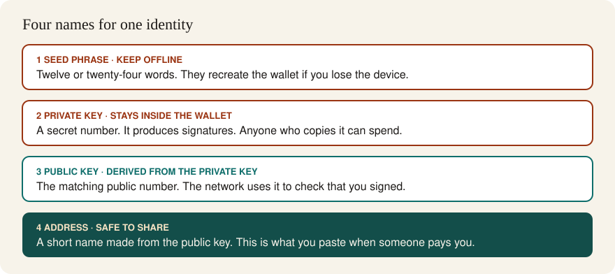

#  2. Keys and signatures

> You can point at a seed phrase, a private key, a public key, and an address, and say what each one is allowed to do.

**Time.** About 3 hours.
**You need.** Stage 1, and a piece of paper you can keep.
**Words you will own.** Hash, private key, public key, address, signature, seed phrase.

## The idea in one minute

A hash fingerprints data. A key pair creates an identity. The private key signs a statement: "I approve this transaction." The public key lets everyone else check that signature. The address is a short public name derived from the public key. The seed phrase is a human-readable backup that can recreate the private key.

The network never needs your private key. It needs your signature.

## Picture

Read it top to bottom. Secret things are in the warm-bordered rows. The address, in the teal row, is the only value you paste into a payment form.

## Hashes, with a kitchen test

Take the sentence "I owe Sam 10". Run it through a hash in your head as a blender: the result is a fixed-length pulp, and you cannot pour the pulp back into the original sentence. Blend the same sentence again and you get the same pulp. Blend "I owe Sam 11" and the pulp looks unrelated.

That is why stage 1's blocks use hashes. The block does not need to understand the payments to notice that one of them changed.

You can see a real hash on paper later. For now, the property list is enough:

- Same input, same hash
- Tiny input change, different hash
- The hash is short, even when the input is a whole block
- The hash does not reveal the input

## Keys are a pair

A wallet generates a private key, which is just a very large random number, and derives the public key from it. Deriving the public key is easy. Reversing that step, and recovering the private key from the public key, is not practical. That one-way street is the whole trick.

| Object | Who should see it | What it is for |
| --- | --- | --- |
| Seed phrase | Only you, on paper, offline | Backup that recreates the keys |
| Private key | Only the wallet | Creates signatures |
| Public key | The network, when it checks a signature | Verifies signatures |
| Address | Anyone you want to pay you | Names the identity in a short form |

People say "the coins are in my wallet." A calmer sentence: the ledger records that this address may spend these coins, and the wallet holds the key that can produce a valid signature. Delete the app, keep the seed, and a new install can sign again. Lose the seed and the key together, and the ledger still shows the coins, with nobody able to sign.

## A signature is a stamped approval

You decide to pay Sam. The wallet builds a transaction: from your address, to Sam's address, for a certain amount, with a nonce so the same approval cannot be replayed forever. The wallet signs that exact message with the private key. Nodes check the signature against your public key. If the message is edited in flight, the signature fails.

You can publish the signature. Publishing it does not publish the private key. This is the point of the design, and it is why a screenshot of a transaction is safe to share, while a screenshot of a seed phrase is a disaster.

> [!IMPORTANT]
> No support agent, faucet, "airdrop", or friend needs your seed phrase to help you. A page that asks you to type those words is taking the wallet. Stage 5 turns this into a practice routine. The rule starts here.

## Wallets are key managers

A wallet is software, or a hardware device, that:

- Creates the seed and the keys
- Shows you an address to receive funds
- Displays a transaction for you to approve
- Signs with the private key and sends the signed transaction to a node

The coins stay on the ledger. The wallet is the pen that signs.

Browser wallets are convenient and always near phishing sites. Hardware wallets keep the key in a separate device. This guide starts with a browser wallet on a test network, where the coins have no market value. Real funds, later, deserve a slower setup than a browser extension. Stage 5 says how to practice without pretending the practice wallet is a vault.

## Try this

Do this on paper. Do not install a wallet yet.

1. Draw the four rows from the picture, with the labels only.
2. Write a fake seed of four ordinary words, such as "river lamp quiet onion", and mark it "example, not a real wallet".
3. Invent a fake address, `0x1234…abcd`, and write "share this" next to it.
4. Explain to a friend, or to the mirror, how Sam can confirm you approved a payment without Sam learning your private key.
5. List three places a seed phrase must never go: chat, email, cloud photo, a website form, a screenshot folder. Pick the three you are most likely to use by accident.

## Check yourself

Someone sends funds to your address. Does the sender need your public key, your private key, or neither?

Neither, in normal use. They need your address. The network can check later signatures with the public key. The sender never needs a secret from you.

You lose your phone, and the wallet app with it. You still have the seed phrase on paper. What is the state of the coins?

The ledger is unchanged. Install a wallet on a new device, restore from the seed, and the same keys, and the same address, come back. The seed is the backup of the signing power.

A hash and a signature both involve one-way math. What is each one proving?

A hash proves "this data has not changed," because the fingerprint would move. A signature proves "the holder of this private key approved this exact message." One is about content. The other is about authorization.

## You should be able to explain

- Why a hash cannot be "decrypted" back into the block
- Why an address is safe to put on a poster, and a seed phrase is not
- Where the coins actually are, if they are not inside the wallet app
- What a node checks when it receives a signed transaction

## Learn

- [Ethereum accounts](https://ethereum.org/developers/docs/accounts/) for the address and key story you will use from stage 4 on
- [Ethereum wallets](https://ethereum.org/wallets/) for the job of a wallet, before you pick a product
- [How bitcoin works](https://bitcoin.org/en/how-it-works) for keys in the payment system you will tour next
- [Blockchain Basics](https://updraft.cyfrin.io/courses/blockchain-basics), the transactions and wallets lessons, if you want the same ideas on video

Skip any article that offers to "generate a wallet" for you on a random site. You will create your own in stage 5, from an official download.

## You are ready for the next stage when

You can sort the four objects from "never type this" to "paste this freely," and you can describe a signature without calling it a password.

[← Foundations](01-foundations.md) · [Hub](README.md) · [Next: Bitcoin →](03-bitcoin.md)
