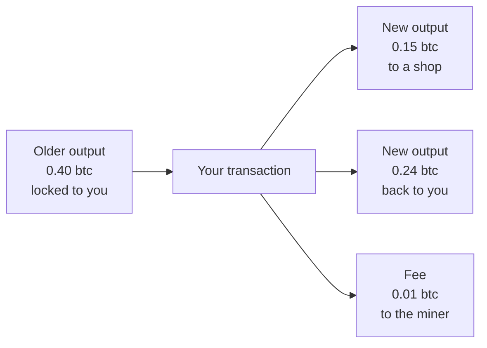

#  3. Bitcoin

> You can open a live Bitcoin block and describe a payment as coins moving from old outputs to new ones.

**Time.** 4–6 hours.
**You need.** Stages 1 and 2.
**Words you will own.** bitcoin (the unit), UTXO, input, output, proof of work, miner, fee.

The icon is a generic coin. Bitcoin's brand mark belongs to its own project. The idea is the part you need.

## The idea in one minute

Bitcoin is a public payment network. The unit people transfer is also called bitcoin. There is no account balance stored as a single number for you. The ledger stores outputs: specific chunks of bitcoin, created by earlier transactions, waiting to be spent. Spending one means pointing at it as an input and writing new outputs. Miners compete to publish the next block of these transactions. The competition is proof of work, and it is still how Bitcoin chooses the next page of the notebook.

## Picture

Read this as cash, not as a bank balance. You hand over a 0.40 note. The shop gets 0.15. You get 0.24 back as a new note. The miner takes the difference as the fee. The old 0.40 note is now spent. It cannot be spent again.

That unspent note is a UTXO: an unspent transaction output.

## Why the design looks like cash

A bank account stores "Sam has 20." Bitcoin stores "this output of 20 is payable to whoever can sign with Sam's key." When Sam pays, the transaction names that output as an input and creates fresh outputs.

This has a few consequences you can see on an explorer:

- One payment often has more than one output, because of change
- Your "balance" is the sum of outputs you can still sign
- Spending the same output twice is invalid. Nodes reject the second attempt
- Privacy is limited. Outputs form a public graph of payments

Ethereum, in the next stage, stores balances in accounts instead. Both designs keep a hash-linked chain. The bookkeeping inside the block is different. Learn this cash picture properly so the account picture has something to contrast with.

## How a new block gets a turn

Bitcoin nodes follow proof of work. Miners bundle valid transactions and vary a number in the block until its hash is small enough to meet a target. That search is expensive in electricity and hardware. The miner who finds a valid hash first publishes the block. Other nodes check the work and the transactions, then add the block.

The cost matters. Rewriting an old block means redoing that search, and then outrunning every honest block mined after it. Stage 1's fingerprint link is the alarm. Proof of work is the reason pulling the alarm is expensive on Bitcoin.

You do not need to mine anything for this guide. Mining is a specialized industry. Understanding the lottery is enough.

> [!NOTE]
> Ethereum used proof of work in its early years and moved to proof of stake in 2022. Articles that say "all blockchains work like Bitcoin mining" are describing one family. Stage 4 covers Ethereum's rule.

## Fees, confirmations, and waiting

When you send a Bitcoin transaction, it waits with other unconfirmed transactions until a miner includes it. A higher fee rate makes it more attractive to include. After it is in a block, more blocks built on top make a rewrite less realistic. Wallets show this as confirmations.

Nothing in this stage asks you to send real bitcoin. Looking at the public network is the whole exercise.

## Try this

1. Open [mempool.space](https://mempool.space/).
2. Click the latest block, or any recent block in the list.
3. Write down the block height, the time, and how many transactions it holds.
4. Open one transaction. Find at least one input and one output. Note the fee.
5. If you see several outputs, decide which one might be a payment and which might be change. You will often be guessing. Write "guess" next to that line. The ledger does not label them for you.
6. Read [How bitcoin works](https://bitcoin.org/en/how-it-works) and fix any sentence in your notes that disagrees with it.

Optional, if you like primary sources: read sections 1 through 4 of the [Bitcoin whitepaper](https://bitcoin.org/bitcoin.pdf). Skip the math on the first pass. The [annotated copy](https://nakamotoinstitute.org/library/bitcoin/) is the same text with more air around it.

## Check yourself

Why can a Bitcoin payment create an output that comes back to the sender?

Inputs are spent in full, like handing over a whole note. The sender writes a change output back to an address they control. The fee is what is left over, not a third coin hiding in the wallet app.

Two transactions try to spend the same output. What does a node do with the second one?

It rejects it. An output can be spent once. This is how the network prevents a double spend of that coin.

You see a payment in the latest block. Why do wallets still talk about waiting for more blocks?

A brand-new block can, in rare cases, be overtaken by a competing chain tip. Each extra block built on top means an attacker has to redo more proof of work to replace that history. More confirmations mean a deeper, more expensive rewrite.

## You should be able to explain

- The difference between an output and an account balance
- What an input spends, and why change exists
- What miners are competing to find, in one sentence
- What a confirmation is counting

## Learn

- [How bitcoin works](https://bitcoin.org/en/how-it-works), the official overview
- [mempool.space](https://mempool.space/), the explorer you just used
- [Developer guide: block chain](https://developer.bitcoin.org/devguide/block_chain.html), a deeper pass after the explorer visit
- [Mastering Bitcoin](https://github.com/bitcoinbook/bitcoinbook), the free book, chapters on transactions and blocks when you want the long version
- [But how does bitcoin actually work?](https://www.youtube.com/watch?v=bBC-nXj3Ng4) if the pictures help more than the prose

Leave Lightning, mining pools, and hardware wallets for later. They are real, and they are easier after this page feels boring.

## You are ready for the next stage when

You can sketch the 0.40 note example from memory, and you have a real block height written in your notes.

[← Keys and signatures](02-keys-and-signatures.md) · [Hub](README.md) · [Next: Ethereum →](04-ethereum.md)
