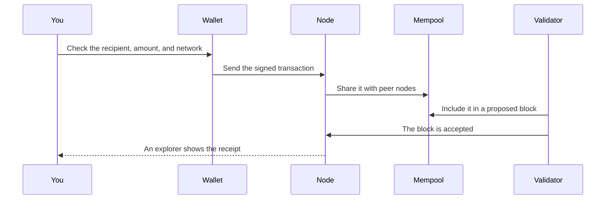

#  4. Ethereum

> You can describe an Ethereum account, say what gas pays for, and trace a transaction from your signature to a block.

**Time.** 4–5 hours.
**You need.** Stages 1 to 3. The Bitcoin picture should still be in your notes.
**Words you will own.** Account, ETH, gas, EVM, smart contract, validator, proof of stake, mempool.

The icon is a hexagon, not Ethereum's logo. The protocol is what you are learning.

## The idea in one minute

Ethereum is a public blockchain with a shared computer on it. People and programs both have accounts. Ether, written ETH, is the asset used to pay for computation. A transaction can move ETH, or it can call a program stored on the network. Those programs are smart contracts. Validators, not miners, take turns proposing and attesting to blocks under proof of stake.

## Picture

The mempool is a waiting room, not a second blockchain. Each node keeps its own view of pending transactions. A transaction is "done" for everyday purposes when it is in a block that later blocks build on. The explorer is a website that reads node data and draws it for humans. The explorer is not the chain.

## Accounts, not loose notes

Bitcoin's ledger is a pile of unspent outputs. Ethereum's ledger is a set of accounts.

| Account | Who controls it | What it holds |
| --- | --- | --- |
| Externally owned account | A private key, through a wallet | An ETH balance and a nonce |
| Contract account | Code stored at that address | An ETH balance, a nonce, and storage |

There is no "change output" to calculate for a simple ETH transfer. The sender's balance goes down. The recipient's balance goes up. The fee is paid in ETH to the validator path, and it is priced in gas.

Your address on Ethereum usually starts with `0x`. It is still the public name from stage 2. The same seed can derive addresses on many networks. An address on a testnet and an address on mainnet can look identical and still be different worlds. The network is part of the context. Stage 5 makes that concrete.

## Gas is a meter for work

Every transaction asks the network to do work: store a change, run contract code, or both. Gas measures that work. You set a fee per unit of gas. The total fee is roughly gas used multiplied by the price you offered.

The fee has a job. It makes infinite loops and spam expensive. It pays the people running validators. It is not a tip you owe a company called Ethereum.

Two user-facing ideas are enough this week:

- A failed transaction can still cost gas. The network did the work up to the failure, then reverted the state change
- The same contract call costs less on a busy Tuesday than the story you read from 2021, and more on a busy minute than on a quiet one. Look up a current fee when you need one. Do not memorize a number from a blog

The plain-language page is [Gas](https://ethereum.org/gas/). The developer page is [Gas and fees](https://ethereum.org/developers/docs/gas/).

## Contracts are programs at addresses

A smart contract is bytecode living in an account, with storage beside it. People write it in languages such as Solidity. The network runs it on the Ethereum Virtual Machine, the EVM.

A useful mental model:

- A contract has functions, like an object in any programming language
- Calling a function that only reads data is free to simulate locally. You are not asking the world to change state
- Calling a function that changes storage requires a transaction, a signature, and gas
- The code cannot reach out and grab your keys. It can only act when a transaction calls it, or when another contract calls it

"Smart" does not mean wise. It means the terms execute as written. A bug executes as written too. That is why stage 6 deploys to a testnet, and why stage 7 refuses to treat your first contract as something strangers should send money to.

## Proof of stake, in one page

Validators lock up ETH as stake and run a client. The protocol picks a validator to propose the next block. Other validators vote on it. A validator who breaks the rules can lose stake. A validator who does the job earns rewards.

You can learn Ethereum for months without running a validator. Staking is a separate operational commitment, with its own docs at [ethereum.org/staking](https://ethereum.org/staking/). This roadmap does not ask you to stake.

The design goal is the same one you saw in Bitcoin: publishing the next page of history should be expensive to fake, and cheap for everyone else to check. The cost is locked capital and slashing risk, rather than a hash lottery.

> [!NOTE]
> Some older books, including parts of [Mastering Ethereum](https://github.com/ethereumbook/ethereumbook), describe proof of work because they were written before the Merge in September 2022. Read them for accounts, transactions, and contracts. Use [proof of stake](https://ethereum.org/developers/docs/consensus-mechanisms/pos/) for how blocks are chosen now.

## Mainnet, testnets, and layers

Mainnet is the Ethereum network where ETH has market value. Testnets are public networks that rehearse the same software with practice ETH. As of October 2026, [Sepolia](https://ethereum.org/developers/docs/networks/) is the testnet application developers use. Hoodi is aimed at protocol and staking tests. You will use Sepolia in stage 6.

Layer 2 networks batch many user transactions and post the results back to Ethereum. They exist because block space on mainnet is scarce. Stage 8 introduces them after you have deployed something simple on Sepolia. Adding three networks in week one creates confused transfers. One network at a time.

## Try this

1. Read [What is Ethereum?](https://ethereum.org/what-is-ethereum/) and write five bullets in your own words. Ban the words "revolutionary" and "the future."
2. Open [What is ether?](https://ethereum.org/what-is-ether/) and write one sentence on what ETH pays for inside the protocol.
3. Open [Transactions](https://ethereum.org/developers/docs/transactions/) and find the fields `nonce`, `to`, `value`, and `data`. Write what each one does.
4. On [sepolia.etherscan.io](https://sepolia.etherscan.io/), open any successful transaction. Match those fields to what the page shows. You do not need a wallet for this.
5. Draw the sequence diagram from memory. Label the mempool as a waiting room.

## Check yourself

How is an ETH balance different from a Bitcoin UTXO?

An ETH balance is a number stored on an account. A UTXO is a specific unspent output from an older transaction. Spending ETH reduces a balance. Spending a UTXO consumes that output and creates new ones.

A contract call reverts. Why might the wallet still show a fee?

Nodes still ran the computation until the revert. Gas pays for that work. The state changes from the call are discarded. The fee is not.

Your friend sends real ETH to your address while your wallet is set to Sepolia. Where did the funds go?

If they sent on mainnet, the funds are on mainnet, controlled by the same key if the address was derived from the same seed. Your Sepolia view will not show mainnet ETH. The network selector is part of the balance. This is a common source of "my transfer vanished" stories. Stage 5 practices on Sepolia only.

## You should be able to explain

- Externally owned account versus contract account
- What gas is metering
- The path signature, mempool, block, explorer
- Why a pre-2022 article about miners can still be useful on Monday and wrong on Tuesday

## Learn

- [What is Ethereum?](https://ethereum.org/what-is-ethereum/)
- [Intro to Ethereum](https://ethereum.org/developers/docs/intro-to-ethereum/)
- [Accounts](https://ethereum.org/developers/docs/accounts/), [Transactions](https://ethereum.org/developers/docs/transactions/), and [Blocks](https://ethereum.org/developers/docs/blocks/)
- [Gas](https://ethereum.org/gas/) and [proof of stake](https://ethereum.org/developers/docs/consensus-mechanisms/pos/)
- [Blockchain Basics](https://updraft.cyfrin.io/courses/blockchain-basics) if you want this stage narrated

Quizzes, if you want a score after the reading: [ethereum.org/quizzes](https://ethereum.org/quizzes/).

## You are ready for the next stage when

You can tell a mainnet ETH balance from a Sepolia balance, and you can name the waiting room a transaction sits in before a block.

[← Bitcoin](03-bitcoin.md) · [Hub](README.md) · [Next: Wallets and safety →](05-wallets-and-safety.md)
