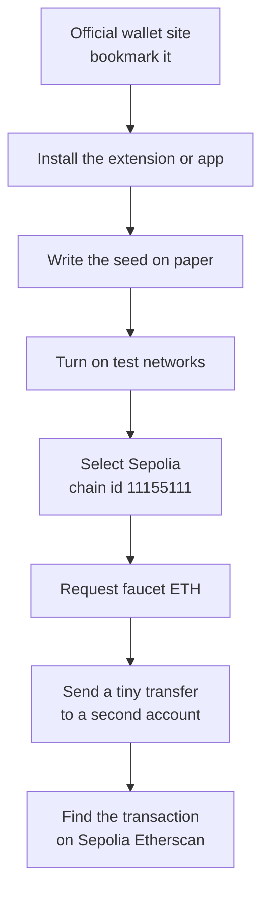

#  5. Wallets and safety

> You can install a wallet from the real publisher, write a seed phrase on paper, and move practice ETH on Sepolia.

**Time.** About 3 hours, plus waiting on a faucet.
**You need.** Stages 1 to 4. A pen and paper. A browser profile you do not fill with random extensions.
**Words you will own.** Seed phrase, hot wallet, testnet, faucet, chain id, approval.

Do this stage before you write a contract. The software will ask you to save twelve or twenty-four words. You want a habit ready before that screen appears.

## The idea in one minute

The wallet holds keys and asks you to sign. The ledger holds the balances. Practice happens on Sepolia, a public test network, with ETH that faucets give away because it has no market price. The seed phrase from this practice wallet is still a real secret for any account that seed can derive, including mainnet. Treat the paper seriously even when the coins are fake.

## Picture

Chain id `11155111` is Sepolia's identifier. If a website claims to be Sepolia and shows a different chain id, you are on some other network.

## Install from the publisher

This guide uses [MetaMask](https://metamask.io/download) because most beginner docs show its screens. Another reputable wallet is fine if you already understand it. The habit is the same either way.

1. Type the address yourself, or follow the link above. Skip ads that sit above the search result.
2. Bookmark the official page before you install.
3. After install, open the extension and compare the publisher with the bookmark.
4. Create a new wallet. Choose a password for the app on this device. The password locks the local app. It is not the seed, and it does not restore the wallet on a new computer.

> [!WARNING]
> A faucet, a support chat, a "wallet repair" site, or a recruiter does not need your seed phrase. They do not need your private key. Close the page. The real support channels will not ask.

Write the seed on paper. Do not photograph it. Do not put it in a notes app that syncs to a cloud. Do not paste it into this roadmap, a chatbot, or a form that says it will "validate" the words.

Store the paper somewhere you can find, away from the computer. For this practice wallet, a desk drawer is enough. For a future wallet that holds savings, you will want a slower plan than a browser extension. That plan is out of scope until you can do this page without rushing.

## Testnets are real networks with play money

Sepolia is public. Transactions are visible on [Sepolia Etherscan](https://sepolia.etherscan.io/). The ETH is still called ETH, which confuses everyone. Look at the network name in the wallet every time you sign.

MetaMask can hide test networks. Turn them on in the network picker, then select Sepolia. If you add the network by hand, or through [Chainlist's Sepolia entry](https://chainlist.org/chain/11155111), check the chain id before you approve the prompt. The wallet may already know Sepolia. Prefer the built-in network when it is there.

### Get practice ETH

Faucets appear and disappear. Start from the official list on [Ethereum networks](https://ethereum.org/developers/docs/networks/). Two that were up in October 2026:

- [Alchemy Sepolia faucet](https://www.alchemy.com/faucets/ethereum-sepolia)
- [Google Cloud Sepolia faucet](https://cloud.google.com/application/web3/faucet/ethereum/sepolia)

A faucet may ask you to sign in with an email or a developer account. It may ask you to paste an address. Pasting an address is normal. Typing a seed phrase is not.

Create a second account inside the same wallet. You will send practice ETH from the first account to the second, so you can watch both sides.

## What you are approving when you sign

Read the wallet prompt as a contract with yourself.

| Prompt detail | What you check |
| --- | --- |
| Network | Sepolia, chain id 11155111, during this guide |
| Recipient | Matches the second account, character by character at the start and the end |
| Amount | A small slice of your faucet ETH |
| Data | Empty for a plain transfer. A contract call will show data. Surprise data means stop |

Later, apps will ask you to approve a token allowance. That signature can let a contract move tokens later, up to the amount you allowed. Unlimited allowances are a common way people get drained after they leave a site. You will not need an allowance in this guide. When you meet one, prefer a limited amount, and revoke it when the experiment is over. [Ethereum security and scam prevention](https://ethereum.org/security/) is the page to keep open while you form this habit.

Other patterns that show up constantly:

- A site offers free tokens and asks you to sign in a hurry
- A DM says you won a mint, a job, or a refund
- The recipient address in the wallet does not match the address on the website
- A popup clones MetaMask and asks you to "import" a seed

None of these require you to be technical. They require you to be rushed. The cure on this page is a slow transfer of play money.

## Try this

1. Install the wallet from the official download page. Bookmark that page.
2. Write the seed on paper. Confirm the words in the wallet's own check.
3. Select Sepolia and confirm the chain id.
4. Request faucet ETH to account 1.
5. Send a small amount to account 2.
6. Open the transaction on [Sepolia Etherscan](https://sepolia.etherscan.io/).
7. In your notes, paste the transaction hash and write: network, from, to, value, and whether it succeeded.
8. Lock the wallet. Unlock it with the password. Notice that you did not need the seed for that.

If the faucet is empty or the queue is long, write down the address and come back. Do not switch the experiment onto mainnet to "make it more real."

## Check yourself

What does the wallet password protect, and what does it fail to do?

It locks the keys on this device. It does not recreate the wallet on a new device. The seed does that. It also does not protect you if you type the seed into a website, because that site then has the keys outright.

Which of these is reasonable for a faucet to ask: your email, your address, your seed phrase?

An address is necessary, because the faucet has to know where to send play ETH. An email or account login is common as an anti-abuse step. A seed phrase is never reasonable.

You meant to stay on Sepolia, and the wallet now shows a mainnet balance you did not buy. What happened?

The same seed derives the same address on mainnet. Someone may have sent real ETH there, or you switched networks and misread a balance. Open the network picker and read it before you sign anything else. Practice ETH does not become mainnet ETH by switching the dropdown. They are separate ledgers.

## You should be able to explain

- Why the practice seed is still a secret
- The chain id you expect for every transaction in the rest of this guide
- The difference between pasting an address and typing a seed
- What you check on a wallet prompt before you press confirm

## Learn

- [Start with Ethereum](https://ethereum.org/start/)
- [Choose a wallet](https://ethereum.org/wallets/find-wallet/) and the [wallet overview](https://ethereum.org/wallets/)
- [Security and scam prevention](https://ethereum.org/security/)
- [Networks](https://ethereum.org/developers/docs/networks/) for Sepolia and the faucet list

## You are ready for the next stage when

Account 2 has received a Sepolia transfer, you can open that transfer on an explorer, and the seed exists on paper and nowhere else.

[← Ethereum](04-ethereum.md) · [Hub](README.md) · [Next: First contract →](06-first-contract.md)
