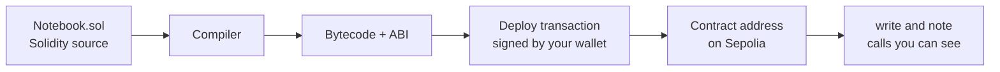

#  6. First contract

> You can write a small Solidity contract, deploy it on Sepolia, and read your own state back from an explorer.

**Time.** 5–8 hours.
**You need.** Stage 5 finished, including faucet ETH on Sepolia. A browser.
**Words you will own.** Solidity, state variable, function, transaction, call, bytecode, ABI.

## The idea in one minute

Solidity is a language for writing contracts. A compiler turns it into bytecode the EVM can run, plus an ABI: a description of the functions so wallets and websites know how to call them. You will write a notebook that stores one string. You will deploy it first to a fake chain inside the browser, then to Sepolia, where stage 5's practice ETH pays the gas.

## Picture



The contract address is new. It is not your wallet address. Your wallet deployed it. The program lives at the new address.

## The contract

Create this file yourself. Typing it beats pasting it, because your eye hits every keyword.

```solidity
// SPDX-License-Identifier: MIT
pragma solidity ^0.8.24;

/// @title A one-line public notebook
contract Notebook {
    string public note;

    function write(string calldata newNote) external {
        note = newNote;
    }
}
```

| Line | What it is doing |
| --- | --- |
| `SPDX-License-Identifier` | Tells the compiler the license. MIT is a normal choice for a public exercise |
| `pragma solidity ^0.8.24` | Accepts compiler 0.8.24 or a newer 0.8 release, and not 0.9 |
| `string public note` | Storage on the contract. `public` also creates a free reader named `note` |
| `write` | Replaces that storage. `external` means a transaction from outside can call it |
| `calldata` | The argument is read from the transaction data and not copied more than it must be |

`0.8` compilers check arithmetic overflow. Use a current `0.8` release. The [Solidity docs](https://docs.soliditylang.org/en/latest/) track the latest one. If Remix offers a newer 0.8 than `0.8.24`, you can switch the pragma to that version. Keep the `^0.8` line and the compiler in agreement.

Reading `note` does not need a transaction. You are asking a node for the current storage. Writing `note` changes the shared ledger, so it needs a signature and gas.

## Deploy in two worlds

Use [Remix](https://remix.ethereum.org/). It compiles and deploys in the browser. You do not need Node.js yet.

### World A, the practice chain inside Remix

1. Create a new file named `Notebook.sol` and put the contract in it.
2. Open the compiler tab. Choose a `0.8` compiler that satisfies the pragma. Compile.
3. Read the warnings. A missing license identifier is the usual one if the first line was dropped. Fix the source. Do not click past red errors.
4. Open the deploy tab. Environment: Remix VM, the local simulated chain.
5. Deploy `Notebook`. The account in Remix VM is a toy account with toy ETH.
6. Under the deployed contract, call `write` with a short sentence.
7. Call `note` and confirm the sentence comes back.

If this fails, stay here. Sepolia will not explain a compiler error more kindly.

### World B, Sepolia

1. In your wallet, select Sepolia. Confirm chain id `11155111`. Confirm you still have faucet ETH.
2. In Remix, set the environment to Injected Provider, the option that talks to your wallet.
3. Approve the connection. Check that Remix shows Sepolia, not mainnet.
4. Deploy. The wallet will ask you to sign a contract creation. The `to` field is empty on a creation, because there is no contract address yet. The data field is the bytecode. That is expected for this step.
5. After it confirms, copy the contract address from Remix.
6. Open the contract address on [Sepolia Etherscan](https://sepolia.etherscan.io/). Wait until the creation transaction shows success.
7. Call `write` again with a new sentence. Find that second transaction on the explorer. Then read `note` from Remix and confirm the sentence changed.

> [!IMPORTANT]
> If the wallet says mainnet, cancel. Practice ETH and mainnet ETH are different balances, and a mainnet deploy spends real money to publish a toy.

Optional: if Remix offers to verify the source on the explorer, do that. Verification publishes the Solidity next to the bytecode so other people can read what you deployed. The contract runs either way.

## What just happened

- The compiler produced bytecode
- A transaction from your externally owned account created a contract account
- The string lives in that contract's storage, on every Sepolia node that has the block
- The ABI is how Remix knew that a button named `write` should exist
- Anyone who has the address can read `note`. `public` means public

The official tour of this shape is [Hello World smart contract](https://ethereum.org/developers/tutorials/hello-world-smart-contract/) and the [smart contract docs](https://ethereum.org/developers/docs/smart-contracts/).

## Mistakes that look like mysteries

| What you see | What it usually means |
| --- | --- |
| Compiler error on the pragma | The selected compiler is older than `0.8.24`, or the line was edited |
| Wallet opens on the wrong network | Remix is connected to mainnet or to a local chain. Switch to Sepolia and reconnect |
| Deploy button seems to do nothing | The wallet popup is behind the browser window, or the site is waiting for a signature |
| "Insufficient funds" on Sepolia | The faucet has not arrived, or the wallet is showing a different account |
| `note` still shows the old text | `write` was simulated, not sent, or the transaction is still pending |
| Explorer says the address is not a contract | The address is your wallet, or the creation transaction reverted |

## Try this

Ship the notebook, then change it on purpose.

1. Deploy to the Remix VM and write "draft".
2. Deploy to Sepolia and write "hello from Sepolia".
3. Save, in your notes: wallet address, contract address, creation transaction hash, and the `write` transaction hash.
4. Change one word in the sentence with a third transaction.
5. In a paragraph, explain why the third action cost gas and the `note` read did not.

## Check yourself

<details>
<summary>Why is the contract address different from the wallet address?</summary>

The wallet address is your externally owned account, controlled by your key. The contract address is a new account created by the deploy transaction. Code and the `note` storage live there. Your key still authorizes transactions that call it, because `write` is public and the caller pays gas. Nothing in this contract checks `msg.sender`.

</details>

<details>
<summary>What would you add if you wanted only your address to change the note?</summary>

A check that `msg.sender` equals an owner stored at deploy time. You will write that check in the tip jar on the next page. This notebook leaves `write` open so you can see a public function with no access control, and feel how open that is.

</details>

<details>
<summary>Where is the ABI used?</summary>

Wallets, Remix, and web apps use it to encode function calls into transaction data and to decode return values. The EVM itself executes bytecode. The ABI is the directory on the door.

</details>

## You should be able to explain

- Source, bytecode, and ABI, and which one the EVM runs
- Why a read and a write are different kinds of requests
- What you check on the wallet prompt during a deploy
- The two addresses in your notes, and which one holds the string

## Learn

Do the Remix exercise before you start a long course. Then pick one course, not all of them.

- [Solidity introduction to smart contracts](https://docs.soliditylang.org/en/latest/introduction-to-smart-contracts.html)
- [Hello World smart contract](https://ethereum.org/developers/tutorials/hello-world-smart-contract/)
- [Cyfrin Updraft: Solidity](https://updraft.cyfrin.io/courses/solidity), the best free project course to continue with
- [Solidity by Example](https://solidity-by-example.org/) as a dictionary after the course, not as your only teacher
- [CryptoZombies](https://cryptozombies.io/) as a second, game-shaped pass. Check the compiler version on each lesson and prefer the habits from current Solidity docs when they differ

## You are ready for the next stage when

A Sepolia explorer page shows your contract, and you can tell a stranger which transaction changed the sentence.

[← Wallets and safety](05-wallets-and-safety.md) · [Hub](README.md) · [Next: Tokens and apps →](07-tokens-and-apps.md)
