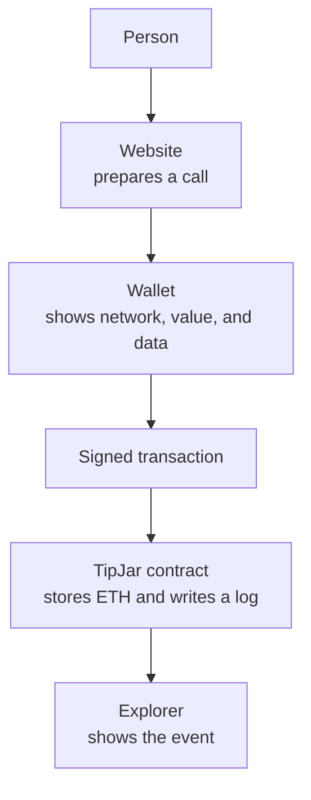

#  7. Tokens and apps

> You can build a tip jar on a testnet, and you can explain a token as a balance stored in a contract.

**Time.** 6–10 hours.
**You need.** A Sepolia notebook from stage 6, and practice ETH left for more deploys.
**Words you will own.** `msg.sender`, `msg.value`, event, ERC-20, ERC-721, dapp.

## The idea in one minute

A decentralized application is an ordinary website plus one or more contracts. The website cannot move funds by itself. It prepares a transaction, and the wallet asks a person to sign. A token is not a separate kind of coin baked into Ethereum. It is a contract that stores balances, or unique ids, and follows a shared interface so wallets know how to display it.

The build on this page is a tip jar, not a token. The token section is here so you can read one without feeling obliged to launch one.

## Picture



If the website vanished, the contract would still be on Sepolia. Someone could call it from a wallet directly. That is the unusual part. The website is a convenience. The contract is the record.

## Build a tip jar

Type this into Remix as `TipJar.sol`. Deploy to the Remix VM first, then to Sepolia, the same two-world routine as stage 6.

```solidity
// SPDX-License-Identifier: MIT
pragma solidity ^0.8.24;

/// @title A practice tip jar. Testnet only.
contract TipJar {
    address public owner;

    event TipReceived(address indexed from, uint256 amount);

    constructor() {
        owner = msg.sender;
    }

    function tip() external payable {
        require(msg.value > 0, "Send some ETH");
        emit TipReceived(msg.sender, msg.value);
    }

    function withdraw() external {
        require(msg.sender == owner, "Not the owner");
        (bool ok, ) = owner.call{value: address(this).balance}("");
        require(ok, "Withdraw failed");
    }
}
```

| Piece | Meaning |
| --- | --- |
| `constructor` | Runs once, in the deploy transaction. The deployer becomes `owner` |
| `msg.sender` | The address that called this function |
| `payable` and `msg.value` | The call can carry ETH. `msg.value` is how much |
| `require` | Stops the call and undoes its state changes if the check fails. Gas is still spent |
| `event` and `emit` | Writes a log. Apps and explorers read logs because reading every storage slot is awkward |
| `indexed` | Lets an explorer search tips by the `from` address |
| `address(this).balance` | How much ETH the contract currently holds |
| `call` | Sends that ETH to the owner. The boolean says whether the send succeeded |

Walk it on the Remix VM:

1. Deploy. Check that `owner` is the toy account Remix used.
2. Switch to a second Remix account if the VM lets you, and call `tip` with a little ETH. `withdraw` from that second account should fail the owner check.
3. Switch back to the owner and call `withdraw`. The contract balance should return to zero.
4. Repeat the same story on Sepolia, with two accounts from stage 5. Save both transaction hashes.

> [!WARNING]
> This contract is a lesson on a testnet. It is not a template for money other people rely on. It does not pause, it does not cap a tip, and it has not been reviewed. Shipping a small variant of it to mainnet "to see what happens" spends real ETH and asks strangers to trust unreviewed code.

The [smart contract security guide](https://ethereum.org/developers/docs/smart-contracts/security/) is the page to skim after the jar works, so the gap between a lesson and a production contract is visible early.

## What a token actually is

ERC-20 and ERC-721 are interface standards. A contract that implements the interface can be shown by wallets. The standard does not make the contract safe, useful, or honest.

| Standard | What is fungible here | What the contract remembers | Everyday name |
| --- | --- | --- | --- |
| [ERC-20](https://ethereum.org/developers/docs/standards/tokens/erc-20/) | Each unit is interchangeable | A balance for each address | "Token" or "coin" |
| [ERC-721](https://ethereum.org/developers/docs/standards/tokens/erc-721/) | Each id is distinct | An owner for each id | NFT |

The original proposals are [EIP-20](https://eips.ethereum.org/EIPS/eip-20) and [EIP-721](https://eips.ethereum.org/EIPS/eip-721). The [OpenZeppelin contracts docs](https://docs.openzeppelin.com/contracts/5.x/) show maintained implementations. Read those before you write your own accounting. The [OpenZeppelin wizard](https://wizard.openzeppelin.com/) can draft a token for you. Use it later to read generated code, not as the first button on day one. Generated code you cannot explain is a poor teacher.

A famous ERC-20 you can read without sending a transaction is Wrapped Ether. Open the contract tab on [WETH on Etherscan](https://etherscan.io/token/0xC02aaA39b223FE8D0A0e5C4F27eAD9083C756Cc2) and look for balances and `transfer`. Do not press write functions while your wallet is on mainnet.

### Leave token launches alone

Minting a token that strangers can buy is a financial product. It adds legal, security, and support duties this roadmap does not cover. A solid portfolio shows a tip jar, a tested contract, and a clear README. It does not need a mainnet ticker.

## The website, when you want one

A page in front of the tip jar does three jobs:

1. Show the contract address and the network, in text, so the human can compare them with the wallet
2. Read `owner` and the contract balance through a node, no signature required
3. Offer a button that asks the wallet to call `tip` with a value the human typed

Libraries that speak to Ethereum from JavaScript include [viem](https://viem.sh/) and [ethers v6](https://docs.ethers.org/v6/). Learn one. viem is a strong default with current tutorials. ethers v6 still appears in many existing codebases.

You do not have to build the page to finish this stage. If you do, keep it ugly and correct. Show the chain id on the page. Refuse to offer the button when the wallet is on any network other than Sepolia.

The [Ethereum stack](https://ethereum.org/developers/docs/ethereum-stack/) diagram is the map of how that page, the wallet, the node, and the contract sit together. [Speedrun Ethereum](https://speedrunethereum.com/) is a project series for after this jar feels small.

## Try this

1. Deploy `TipJar` to the Remix VM. Break `withdraw` from the wrong account on purpose.
2. Deploy to Sepolia from account 1. Tip from account 2. Withdraw from account 1.
3. Open the tip transaction on Sepolia Etherscan and find the `TipReceived` log.
4. Read the ERC-20 page and write, in two sentences, where a token balance lives.
5. Open the WETH contract source. Find `transfer`. Do not send a mainnet transaction.
6. Optional: a one-page website that reads the owner. No styling requirements.

## Check yourself

<details>
<summary>The tip jar has no mapping of balances. Where is the tipped ETH?</summary>

It is the contract account's ETH balance, `address(this).balance`. An ERC-20 token would instead store numbers in its own storage. Both are "balances." They live in different places. Native ETH does not need a token contract to exist.

</details>

<details>
<summary>Why log an event if the balance already changed?</summary>

The balance says how much is there now. The event says who sent a tip and how much, in a log that indexers can filter. Storage and logs answer different questions. Many apps listen to logs because the alternative is reconstructing history from every transaction.

</details>

<details>
<summary>A website button says Tip. What has to happen before ETH moves?</summary>

The wallet must show a transaction to your contract, on Sepolia, with the value you chose, and a person must sign it. A website click by itself is only a request to the wallet.

</details>

## You should be able to explain

- `msg.sender`, `msg.value`, and `owner` in the tip jar
- Why the second account cannot withdraw
- The difference between ETH held by a contract and an ERC-20 balance
- Why this repository's projects stay on a testnet

## Learn

- [Smart contracts](https://ethereum.org/smart-contracts/), the non-technical overview
- [ERC-20](https://ethereum.org/developers/docs/standards/tokens/erc-20/) and [ERC-721](https://ethereum.org/developers/docs/standards/tokens/erc-721/)
- [OpenZeppelin Contracts 5.x](https://docs.openzeppelin.com/contracts/5.x/)
- [Smart contract security](https://ethereum.org/developers/docs/smart-contracts/security/)
- [Alchemy University](https://www.alchemy.com/university) if you want a browser course aimed at full-stack apps after this page
- The [Ethereum stack](https://ethereum.org/developers/docs/ethereum-stack/) for where the page, the wallet, and the contract sit

Use-case reading, when you want context rather than code: [DeFi](https://ethereum.org/defi/), [NFTs](https://ethereum.org/nft/), and [DAOs](https://ethereum.org/dao/). Read them as maps of what contracts are used for. Building a lending protocol is not the next assignment.

## You are ready for the next stage when

Your notes contain a Sepolia tip-jar address, a tip transaction with a visible log, and a sentence about where an ERC-20 balance lives.

[← First contract](06-first-contract.md) · [Hub](README.md) · [Next: Where to go next →](08-where-next.md)
