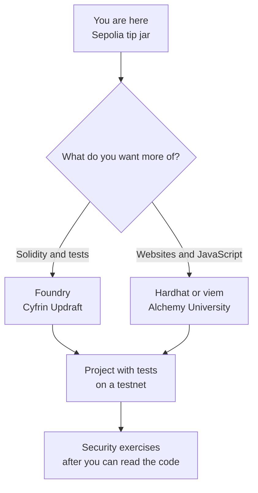

#  8. Where to go next

> You can choose one toolkit, one course, and a practice calendar, and you can say what you are ignoring on purpose.

**Time.** About 2 hours to choose. Months to practice.
**You need.** The tip jar from stage 7, or an honest note about which stage you are still on.
**Words you will own.** Layer 2, rollup, test, framework.

## The idea in one minute

You can already read a chain and deploy a small program. The next skill is repetition with better tools: local tests, a framework, and contracts slightly larger than a single file. The way to stall is to collect five chains, four frameworks, and a mainnet token in the same month.

Pick one path below and stay on it until you finish one project from the [projects page](projects.md).

## Picture

## Layer 2, without collecting networks

Mainnet block space is scarce, so fees spike when demand spikes. Layer 2 networks, also called L2s, run many user transactions off the main chain and post compressed results, or proofs, back to Ethereum. A rollup is the common shape: execution happens on the L2, and Ethereum remains the place where the data or the proof is anchored.

You can deploy the same Solidity to many L2s because they speak EVM. The bridge, the fee token, and the explorer are different. That is enough to get lost.

For this month, Sepolia remains home. When you are ready to look:

- Read [Layer 2](https://ethereum.org/layer-2/) once
- Use [L2BEAT](https://l2beat.com/scaling/summary) to see how a network is built and what stage of proof it is in
- Move your tip jar to one L2 testnet only after you can explain, in a sentence, how a withdrawal gets back to Ethereum

Bridges move assets between chains. They are a common place for mistakes and for attacks against users. [ethereum.org/bridges](https://ethereum.org/bridges/) explains the idea. This guide does not ask you to bridge real ETH.

## Pick one builder path

| Path | Choose it if | Start here | Local tool |
| --- | --- | --- | --- |
| Solidity first | You want tests beside the contract, and you liked Remix | [Cyfrin Solidity](https://updraft.cyfrin.io/courses/solidity), then [Foundry](https://updraft.cyfrin.io/courses/foundry) | [Foundry](https://book.getfoundry.sh/) |
| App first | You already write JavaScript and you want a page in front | [Alchemy University](https://www.alchemy.com/university) | [Hardhat](https://hardhat.org/tutorial) and [viem](https://viem.sh/) |

Both paths are current, free to start, and enough. Foundry tests are written in Solidity. Hardhat tests are written in JavaScript. Learning both in the same two weeks splits your attention in half. The [developer hub](https://ethereum.org/developers/) lists more tools when you have a reason to switch.

[Speedrun Ethereum](https://speedrunethereum.com/) fits after either path, as a set of small products with a frontend.

## Security, in the right order

Start this only after you can read your tip jar line by line.

1. Reread [Smart contract security](https://ethereum.org/developers/docs/smart-contracts/security/) and notice how many items your tip jar does not do.
2. Read the [Consensys best practices](https://consensysdiligence.github.io/smart-contract-best-practices/) as a checklist, not as a weekend project.
3. Work through [Ethernaut](https://ethernaut.openzeppelin.com/) levels slowly. Each level is a contract with a flaw. Write what the flaw is in your notes before you look for a walkthrough.
4. Use [Building Secure Contracts](https://github.com/crytic/building-secure-contracts) from Trail of Bits when you want the professional checklist.
5. After the Solidity course, open the [Cyfrin Updraft catalog](https://updraft.cyfrin.io/courses) and take the security course.
6. [Damn Vulnerable DeFi](https://www.damnvulnerabledefi.xyz/) is a later lab, after ERC-20 transfers feel ordinary.

Ethernaut is a practice range for code you are allowed to break. Pointing those techniques at a contract you do not own is a crime, and it is outside this guide. The skill you want is recognizing a flaw in code you are about to ship.

## After the tip jar

Go to the [projects page](projects.md). Read [blockchain-projects](https://github.com/0xPixelNinja/blockchain-projects) next. It is six Sepolia apps, with Foundry tests and a Next.js frontend. Leave [ShaderMesh](https://github.com/0xPixelNinja/ShaderMesh) until those contracts feel ordinary. ShaderMesh is a larger marketplace: escrow, stake, and off-chain work settled on Ethereum.

Skip these until you have a reason:

- Running a validator
- Writing your own rollup, bridge, or wallet
- A mainnet token, or any project whose point is a price

## Try this

1. Pick the Foundry row or the Hardhat row in the table above.
2. Open the charity docs in [blockchain-projects](https://github.com/0xPixelNinja/blockchain-projects) and name one function the tip jar does not have.
3. Skim [Layer 2](https://ethereum.org/layer-2/) and write one sentence you could say to a newcomer.

## Check yourself

Why does this guide keep you on Sepolia for so long?

One network means one chain id, one faucet, and one explorer. An L2 adds a bridge and a second set of balances. Those are worth learning after deploys feel routine, because the extra moving parts hide simple mistakes.

Foundry and Hardhat both deploy contracts. What is the actual choice?

Where you want to spend your practice hours. Foundry keeps you in Solidity, including tests. Hardhat sits in a JavaScript project and matches frontend tutorials. The chain does not prefer one of them.

When is a security challenge useful, and when is it noise?

It is useful when you can already read the contract and write down the broken assumption. It is noise when you paste a solution you cannot explain. Ethernaut after the tip jar is useful. Ethernaut on day two is a pile of words.

## You should be able to explain

- What a rollup is anchoring back to Ethereum
- Which framework you chose, and what you postponed
- Which app in blockchain-projects you will read first, and why
- The difference between a practice flaw and someone else’s production contract

## Learn

- [Layer 2](https://ethereum.org/layer-2/) and [L2BEAT](https://l2beat.com/scaling/summary)
- [Foundry book](https://book.getfoundry.sh/) or the [Hardhat tutorial](https://hardhat.org/tutorial)
- [Cyfrin Updraft courses](https://updraft.cyfrin.io/courses/blockchain-basics) and [Alchemy University](https://www.alchemy.com/university)
- [Ethereum roadmap](https://ethereum.org/roadmap/)
- The full [resource library](resources.md)

[← Tokens and apps](07-tokens-and-apps.md) · [Hub](README.md) · [Projects →](projects.md)
