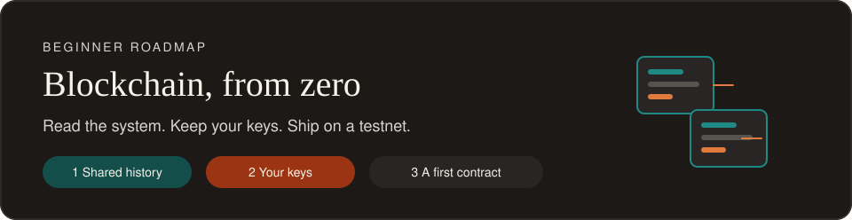
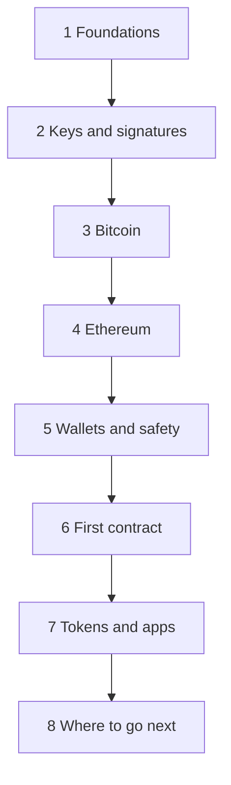

#  Blockchain Roadmap

> A beginner path from the idea of a shared ledger to reading a real transaction and deploying a small contract on a test network.

You can finish the whole path in a browser, without buying cryptocurrency we will use testnet networks. Stages 1 to 5 are concepts. [Stage 6](06-first-contract.md) is the first time you write [Solidity](https://docs.soliditylang.org/en/latest/introduction-to-smart-contracts.html).

## How to use it

1. Follow the eight stages in order.
2. On each page, read the diagram, do the exercise, then open the answer under it.
3. Tick that stage on the checklist at the bottom of this page.

## Prerequisites

- A computer and a modern browser
- A place to keep notes
- About 30 to 40 hours for one full pass

Helpful later, and fine to learn alongside stage 6:

- Basic JavaScript: variables, functions, and objects. Mozilla's [JavaScript guide](https://developer.mozilla.org/en-US/docs/Learn_web_development/Core/Scripting) is enough.
- Comfort with a terminal, only if you choose a local toolkit in [stage 8](08-where-next.md)

## The map

Safety sits before code on purpose. A wallet is a key holder. You want the rules before the software asks you to save twelve words.

## Learning path

| | Stage | You will be able to | Guide time |
| --- | --- | --- | --- |
|  | [1. Foundations](01-foundations.md) | Explain a block, a hash link, and what a shared ledger is for | 3–4 hours |
|  | [2. Keys and signatures](02-keys-and-signatures.md) | Separate a seed phrase, a private key, a public key, and an address | 3 hours |
|  | [3. Bitcoin](03-bitcoin.md) | Read a Bitcoin transaction as coins moving between outputs | 4–6 hours |
|  | [4. Ethereum](04-ethereum.md) | Describe accounts, gas, and a transaction's path into a block | 4–5 hours |
|  | [5. Wallets and safety](05-wallets-and-safety.md) | Create a practice wallet and move test ETH without exposing a seed | 3 hours |
|  | [6. First contract](06-first-contract.md) | Write, deploy, and read a storage contract on Sepolia | 5–8 hours |
|  | [7. Tokens and apps](07-tokens-and-apps.md) | Build a tip jar and explain what a token contract records | 6–10 hours |
|  | [8. Where to go next](08-where-next.md) | Choose one toolkit and a 30-day or 90-day practice plan | 2 hours, then months |

Companion pages:

| | Page | Use it when |
| --- | --- | --- |
|  | [Projects](projects.md) | The two builds, then larger repos to read and run |
|  | [Glossary](glossary.md) | A word shows up and you want one calm definition |
|  | [Resource library](resources.md) | You want the full link list in one place |

## Completion checklist

Tick a line when that stage's exercise is done. The hidden questions on each page are the quiz. This list is only the finish line.

- [ ] [Foundations](01-foundations.md): change a block in the demo and watch the next hash break
- [ ] [Keys](02-keys-and-signatures.md): write seed phrase, private key, public key, and address, and mark which one you can share
- [ ] [Bitcoin](03-bitcoin.md): open one live block and name an input and an output
- [ ] [Ethereum](04-ethereum.md): open one transaction and find the recipient and the amount
- [ ] [Wallet](05-wallets-and-safety.md): send Sepolia ETH between two of your own accounts
- [ ] [First contract](06-first-contract.md): deploy the notebook and read it on Sepolia Etherscan
- [ ] [Tip jar](07-tokens-and-apps.md): tip from a second account, then withdraw as the owner
- [ ] [Next](projects.md): read the charity project in [blockchain-projects](https://github.com/0xPixelNinja/blockchain-projects)

## Contributing

Found a stale link, a clearer picture, or a better beginner exercise?

See the repository [CONTRIBUTING.md](../../CONTRIBUTING.md). Add your name to the contributors table in the repository README when your pull request is ready.

[Start with foundations →](01-foundations.md)
