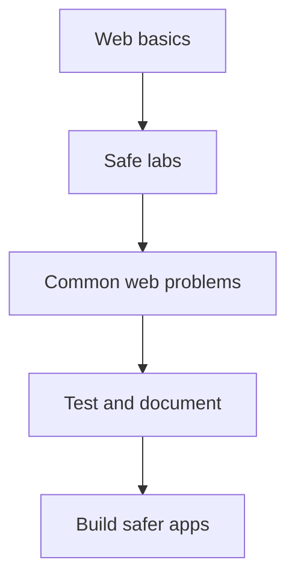

# Web Application Security Roadmap

<p align="center">
  <a href="https://roadmap.sh/pdfs/roadmaps/cyber-security.pdf"></a>
  <a href="https://portswigger.net/web-security/learning-paths"></a>
  <a href="https://owasp.org/www-project-juice-shop/"></a>
</p>

> A clear path for learning how web apps work, how they can fail, and how to help make them safer.

<p align="center">
  <a href="#1-understand-the-web"></a>
  <a href="#2-build-a-safe-lab"></a>
  <a href="#3-learn-the-common-problems"></a>
  <a href="#bug-bounty-tool-shelf"></a>
</p>

## Start Here

> Only test apps you own or labs that clearly allow testing. Learning labs are the right place to make mistakes and learn from them.

You do not need a security background to begin. Basic HTML, JavaScript, browser DevTools, and command-line basics will help a lot.

### Your Main Paths



Pick the pace that works for you:

| Path | Best for | Start with |
| --- | --- | --- |
| Builder | Developers who want to write safer code | Web basics, OWASP Top 10, secure fixes |
| Tester | Learners who enjoy finding issues in safe labs | PortSwigger learning paths, Burp Suite, lab notes |
| Explorer | Complete beginners | HTTP, browser DevTools, Juice Shop |

---

## Learning Path

### 1. Understand the Web

[](#1-understand-the-web)

Learn what happens when you open a website. A browser sends a request, a server processes it, and a response comes back.

#### Learn

* [MDN - HTTP](https://developer.mozilla.org/en-US/docs/Web/HTTP)
* [MDN - Web security](https://developer.mozilla.org/en-US/docs/Web/Security)
* [PortSwigger - Essential skills](https://portswigger.net/web-security/essential-skills)

#### Practice

Use browser DevTools on an app you built. Look at five requests and explain the URL, method, headers, and response code in your own words.

#### You should know

* Requests and responses
* HTTP methods and status codes
* Headers, cookies, and sessions
* Forms, query parameters, and JSON
* HTTPS and TLS basics

---

### 2. Build a Safe Lab

[](#2-build-a-safe-lab)

Learn in places made for practice. Do not use real websites as a playground.

#### Learn and Practice

* [PortSwigger Web Security Academy](https://portswigger.net/web-security) - free lessons and hands-on labs
* [PortSwigger Learning Paths](https://portswigger.net/web-security/learning-paths) - a guided route through the Academy
* [OWASP Juice Shop](https://owasp.org/www-project-juice-shop/) - a modern practice app with a built-in score board
* [OWASP WebGoat](https://owasp.org/www-project-webgoat/) - guided lessons in a local practice app

#### Your Mission

Set up one lab and finish your first beginner exercise. Keep a small notes file with what you tried and what you learned.

#### You should know

* What permission and scope mean
* How to read a request and response
* Browser DevTools and Burp Suite Community Edition basics
* How to keep useful notes

---

### 3. Learn the Common Problems

[](#3-learn-the-common-problems)

Start with the problems web teams see most often. Learn why they happen, what they affect, and how to prevent them.

#### Learn

* [OWASP Top 10](https://owasp.org/projects/top-ten)
* [OWASP Web Security Testing Guide](https://owasp.org/projects/web-security-testing-guide)
* [OWASP Cheat Sheet Series](https://cheatsheetseries.owasp.org/)

#### Practice

Finish beginner labs on access control, login problems, and input handling. After each lab, write one sentence about the cause and one sentence about the fix.

#### You should know

* Access control and IDOR
* Login and session problems
* Cross-site scripting, also called XSS
* Injection basics
* Cross-site request forgery, also called CSRF
* File upload and path traversal basics
* Security misconfiguration

`dont limit to these, there are a lot of other vulns aswell, these are just for the reference`

<details>
<summary>Simple way to think about a web security problem</summary>

Ask these questions:

1. What data goes in?
2. Who should be allowed to do this?
3. What should the app check?
4. What could go wrong if it does not check?
5. How can the app be fixed?

</details>

---

### 4. Learn to Test and Think Clearly

[](#4-learn-to-test-and-think-clearly)

Testing is not about trying random things. First understand the feature, the people who use it, and the data it handles.

#### Learn

* [OWASP Threat Modeling Cheat Sheet](https://cheatsheetseries.owasp.org/cheatsheets/Threat_Modeling_Cheat_Sheet.html)
* [OWASP Secure Code Review Cheat Sheet](https://cheatsheetseries.owasp.org/cheatsheets/Secure_Code_Review_Cheat_Sheet.html)

#### Practice

Choose a feature in a training app, such as profile editing or checkout. Draw its steps, list the user roles, and note the data it handles.

#### You should know

* Pages, APIs, and user roles
* Input and output checks
* Trust boundaries
* Basic threat modeling
* Clear testing notes

---

### 5. Learn Modern Web Security

[](#5-learn-modern-web-security)

Many apps use APIs, tokens, single-page apps, and third-party sign-in. Learn the basics before moving to harder labs.

#### Learn

* [PortSwigger - API testing](https://portswigger.net/web-security/api-testing)
* [OWASP REST Security Cheat Sheet](https://cheatsheetseries.owasp.org/cheatsheets/REST_Security_Cheat_Sheet.html)
* [OWASP JSON Web Token Cheat Sheet](https://cheatsheetseries.owasp.org/cheatsheets/JSON_Web_Token_for_Java_Cheat_Sheet.html)

#### Practice

Use a local lab to map one API flow. Note what data is sent, what the response returns, and which user should be allowed to use the action.

#### You should know

* REST API basics
* JSON Web Tokens, also called JWTs
* CORS basics
* OAuth and single sign-on basics
* API access control

---

### 6. Write Reports That Help

[](#6-write-reports-that-help)

A good report is simple to read and easy to repeat. It explains the issue, the effect, and a possible fix.

#### Practice

Write a report for a lab you finished. Use the template below.

<details>
<summary>Lab report template</summary>

```text
Title: What is the issue?

Where: Which training lab or local app did you use?

What happened: Explain the issue in simple words.

Steps: List the safe steps used in the lab.

Impact: What could happen if this was not fixed?

Fix: What should the developer change?

What I learned: One short note for your future self.
```

</details>

#### You should know

* Clear steps to repeat a finding
* Impact without guessing or overclaiming
* Helpful evidence and screenshots
* Fix ideas for developers

---

## Resource Shelf

| Resource | Why it is useful |
| --- | --- |
| [PortSwigger Learning Paths](https://portswigger.net/web-security/learning-paths) | A guided, hands-on route through web security topics. |
| [roadmap.sh Cyber Security Roadmap](https://roadmap.sh/pdfs/roadmaps/cyber-security.pdf) | A bigger picture of skills beyond web security. |
| [OWASP Top 10](https://owasp.org/projects/top-ten) | A practical list of important web app risks. |
| [OWASP Cheat Sheet Series](https://cheatsheetseries.owasp.org/) | Short, useful guides for learning and building. |
| [OWASP Juice Shop](https://owasp.org/www-project-juice-shop/) | A fun local practice app with challenges. |
| [WebGoat](https://owasp.org/www-project-webgoat/) | Guided lessons for safe practice. |
| [MDN Web Security](https://developer.mozilla.org/en-US/docs/Web/Security) | Clear web platform and browser security basics. |

## Bug Bounty Tool Shelf

> [!WARNING]
> Read the program rules before using any tool. Passive research is usually quieter, but it still needs to stay inside the program's scope. Only use active testing tools when the rules clearly allow them, and follow rate limits.

Tools do not replace thinking. Use them to understand an allowed target, then test carefully and write down what you find.

### Start With These

| Tool | What it helps with | Type |
| --- | --- | --- |
| [Browser DevTools](https://developer.chrome.com/docs/devtools) | Reading pages, requests, storage, and JavaScript in your browser. | Manual testing |
| [Burp Suite Community Edition](https://portswigger.net/burp/communitydownload) | Looking at and repeating web requests in a lab or approved program. | Manual testing |
| [OWASP ZAP](https://www.zaproxy.org/) | An open-source web testing proxy and scanner. | Scoped testing |
| [Wappalyzer](https://www.wappalyzer.com/) | Seeing the technology a website uses. | Passive research |
| [Shodan](https://www.shodan.io/) | Learning about internet-facing services and technology. | Passive research |

### Helpful Next Tools

| Tool | What it helps with | Type |
| --- | --- | --- |
| [subfinder](https://github.com/projectdiscovery/subfinder) | Finding subdomains from passive sources. | Passive research |
| [httpx](https://github.com/projectdiscovery/httpx) | Checking which approved web hosts respond. | Scoped testing |
| [Nuclei](https://docs.projectdiscovery.io/opensource/nuclei/overview) | Checking allowed assets with community security templates. | Scoped testing |
| [ffuf](https://github.com/ffuf/ffuf) | Finding hidden content in a lab or where a program allows it. | Scoped testing |
| [Nmap](https://nmap.org/) | Understanding services on systems you are allowed to test. | Scoped testing |
| [crt.sh](https://crt.sh/) | Looking up certificate transparency records. | Passive research |
| [urlscan.io](https://urlscan.io/) | Viewing public scans and page details. | Passive research |
| [Wayback Machine](https://web.archive.org/) | Finding older public pages and URLs. | Passive research |

<details>
<summary>Simple tool checklist before you run anything</summary>

* Is this domain or IP clearly in scope?
* Does the program allow this kind of testing?
* What is the stated rate limit?
* Can I start with a small, safe check?
* Will I save notes so I can explain what happened?

</details>

## Progress Board

Use these boxes as your own learning log. GitHub lets you tick them as you go.

<p align="center">
  
  
  
</p>

* [ ] I understand the parts of an HTTP request and response.
* [ ] I set up a safe practice lab.
* [ ] I completed my first PortSwigger learning path lesson.
* [ ] I completed beginner labs for three common web security problems.
* [ ] I made a simple threat model for an app I own or a training app.
* [ ] I wrote a clear lab report.
* [ ] I fixed one security issue in an app I own.

## Contributing

Have a beginner-friendly resource, a safer lab, or a clearer explanation to add?

See the repository's [contribution guide](../../CONTRIBUTING.md).
